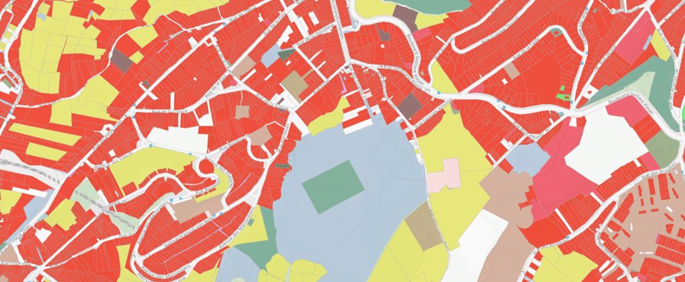
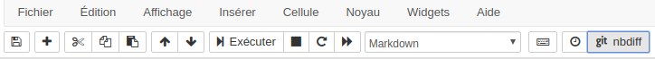
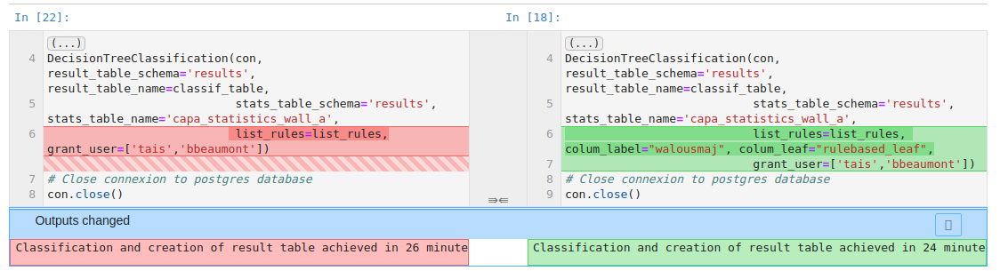
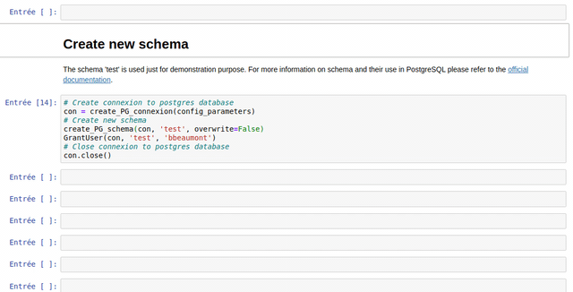
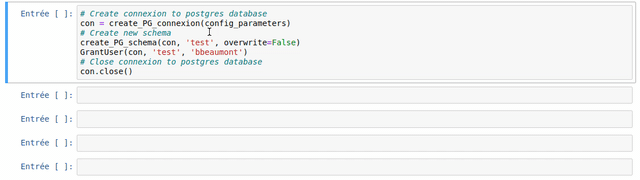

# Automated processing chain for production of CUSW product - WalOUS project
This repository contains the code for automated rule-based classification of land use in Wallonia, Belgium. 


This research was conducted by [Université Libre de Bruxelles](http://igeat.ulb.ac.be/fr/unites-de-recherche/details/unit/analyse-geospatiale/), [UCLouvain](https://uclouvain.be/fr/node/2517) and [ISSeP](https://www.issep.be/teledetection-et-geodonnees/) in the context of the WalOUS project founded by the [Geomatic departement of Service Public de Wallonie](https://www.wallonie.be/fr/acteurs-et-institutions/wallonie/spw-secretariat-general/departement-de-la-geomatique). 


## Introduction  
The processing chain has been designed and implemented in such a way that it is as automated as possible while remaining easily executable by a user not highly specialized in programming. Moreover, knowing that the code and the method will evolve over time, a particular intention has been put to offer the possibility to modify easily the main functions in the processing chain. It is thus possible, for example, to add new sources information or change the WalOUS HILUCS lookup tables.
The project deliverable describing the method implemented is available on request from the SPW. 

The automated processing chain for land use classification is provided as a series of Jupyter Notebook files, with the extension ".ipynb". Jupyter Notebooks are widely used in the computer sphere because it has the advantage of being able to combine, in the same file, the programmer's and/or user's guide and the code computer science strictly speaking. This code can be directly executed in Jupyter Notebook. This is very useful, especially when one needs to "interact" with the code, i.e. to perform the individual processing steps by executing the code cells sequentially (one block of code after another) ensuring that no errors occur between each step (debugging). In addition, Jupyter Notebooks allow you to display the content of the tables stored on the PostgreSQL database directly, without having to go through a database client software (e.g. PgAdmin).

Within the processing chain, several software and programming languages are used. The data tables, both spatial and non-spatial, are integrated into a PostgreSQL database with the PostGIS extension for spatial analysis functions. The SQL language is used for queries on the PostgreSQL database. The Python language is used for the automation of the different steps as well as the automatic generation and launching of SQL queries to the database (via psycopg library). Some pre-processing of the data is done in GRASS GIS, but in an automated way via the Python API of the software.

Wherever possible, most repetitive steps are coded as functions. These functions are written and stored in Python scripts in a separate folder to avoid overloading the Notebook content and confusing average users. At the beginning of each Jupyter Notebook, the functions required for processing are imported for use. All the functions obviously remain accessible from the folder which is dedicated to them, in order to allow the more experienced user to be able to understand how the functions work and possibly to be able to adapt them to meet changes in needs, procedures and/or data formats. 

## Content of this repository
The folder ['SRC'](https://github.com/tgrippa/WALOUS_LU/tree/master/SRC) contains the customized functions used in the different Jupyter Notebooks. The folder ['notebook'](https://github.com/tgrippa/WALOUS_LU/tree/master/notebook) contains 7 different Jupyter Notebooks which constitute the processing chain. Each corresponds to a key stage of the methodology, as follows:
- A_Compute_LcProp_and_RnppDensity_By_Capa.ipynb: Steps for data preprocessing, i.e. the calculation of the proportions of the COSW2018 classes and population density classes in a neighbourhood of 200 metres;
- B_Importation_Postgresql.ipynb: Importation of source data into the PostgreSQL data ;
- C_1_Aggregate_statistics_by_CaPa.ipynb: Spatial analysis steps required to aggregate the different sources of information the cadastral parcel level (i.e. the mapping unit for the land use map) ;
- C_2_Classification_Rule_based.ipynb: Steps for the application of rules-based classification to establish the attribute "walousmaj".
- C_3_Postclassification.ipynb: Post-classification steps including correction of "garden parcels" and creation of attributes compatible with INSPIRE HILUCS; 
- D_Descriptive_statistics.ipynb: Calculation of descriptive statistics on the different information available in the database ;
- E_Validation.ipynb: Production of indicators to assess the classification accuracy.

## Installation
### Anaconda virtual environment
To install all required python libraries, we recommend using Anaconda virtual environment. Before going further, please make sure Anaconda (Python3) is installed
on your computer. For more information regarding the management of environments with Anaconda please visit
the official [help](https://docs.conda.io/projects/conda/en/latest/user-guide/tasks/manage-environments.html).


Clone this repository on your computer using the following git command or using the direct download [link](https://github.com/tgrippa/WALOUS_LU/archive/master.zip).
``` bash
# Clone repository
git clone https://github.com/tgrippa/WALOUS_LU.git
cd WALOUS_LU/
```

Create a virtual environment using anaconda from the .yml file provided in this repository.
``` bash
# Create environment
conda env create -f environment_walous_lu.yml

# Verify that the new environment was installed correctly
conda env list
```

If you make changes to the anaconda environment, e.g. by installing new packages, don't forget to create a new environment file to keep your development reproducible
``` bash
# Activate the anaconda environment
conda activate walous_lu

# Create an environment file (yml) from the current active environment
conda env export --from-history > environment_walous_lu.yml
```

### Launch Jupyter notebook

Once the installation is completed, including all dependencies (see the dedicated section in this README), you can launch a Jupyter notebook kernel to start working with the Jupyter notebook files. 

``` bash
# Activate the anaconda environment
conda activate walous_lu

# Launch Jupyter Notebook in 'walous_lu' environment
jupyter notebook
```
After executing the previous command in your terminal, you should have a Jupyter notebook kernel running through your terminal and a new tab that appeared in your web browser software which allows you to open and run the different Jupyter notebooks provided.  

## Monitor changes between version (Git/Github) of Jupyter notebooks
The anaconda environment provided with this repository include [nbdime](https://nbdime.readthedocs.io/en/latest/index.html) to monitor changes between your local version of your Jupyter Notebooks and the last commit you made. To see the changes, just click on the "git nbdiff" button:


This will open a new tab in your web browser and display only cells that changed and the differences between them. 



## How to use
The Jupyter Notebooks are designed to be the most reusable and adaptable as possible. 

### General usage of the Jupyter Notebooks
The notebooks are made of different types of cells: titles, text (markdown) and Python code.


### Display functions help (Docstrings)
The use of each customize function created in the frame of the WalOUS project has been documented with [Docstrings](https://www.python.org/dev/peps/pep-0257/#id15). To easily display the help (the Docstring) of a function, just put your mouse cursor in the parenthesis of the function and type maj+tab. A pop-up will appear with the description of the function and the parameters.


## Dependencies
- GRASS GIS 7.8 (on the machine executing the Jupyter Notebook)
- Postgresql 9.6 (on the server machine) 
- Postgis 2.2.4 (both on the server machine)
- Anaconda 3 with Python 3 (on the machine executing the Jupyter Notebook)
- GDAL 3.0.4 (on the machine executing the Jupyter Notebook)

## Prerequisite
- A dedicated database with PostGIS extension activated should already have been created on the PostgreSQL server.

## Development environment used
This code has been developed using under the following operating system: Ubuntu 18.04.04 LST.

## Caution regarding the storage of plaintext credentials (passwords)
The solution implemented in this repository store credentials (username and passwords) for connexion to the database in plaintext. It means that passwords are visible in the configuration file and can be printed in Jupyter Notebooks cells' output. Be carefull before cloning this repository and storing your material on a public repository or on a unsecured environment. More development will be needed to make the management of credential more secure.  

## Acknowledgment
The authors gratefully thanks the Geomatics division of the Walloon Public Services (SPW, SPW-ARNE and Geomatic department) founding the WalOUS project.  

## Citing this code 
[](https://doi.org/10.5281/zenodo.4108713)
